# Armillary — モーション実験ラボ

スクロールやドラッグに合わせて動く Web 表現を、1 つずつ小さな実験として作り、1 枚のページに並べたものです。
「きれいに動く」だけで終わらせず、**なぜその動きになるのか**（数式・物理・知覚の仕組み）を実装とテストで確かめながら作っています。

**▶ サイトを見る: https://mgitgod.github.io/armillary/**

[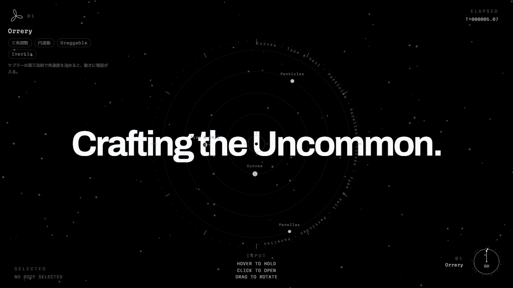](https://mgitgod.github.io/armillary/)

## 見方

- 上から下へスクロールすると、実験が 1 つずつ切り替わります。スクロール量がそのまま演出の進み具合になっています
- 右下の円形のダイヤルは目次です。いま何番目の実験を見ているかを示します
- 最初の Orrery（太陽系儀）は入口です。惑星はラボの 4 つの分類で、クリックするとその分類の中身が出ます。ドラッグで回すこともできます
- 各実験の左上に、名前・使った技法・何を試したかの一言が出ます

## 実験一覧

GIF は実際のページをスクロール・操作しながら撮ったものです（縮小しています）。

<table>
<tr>
<td width="50%" valign="top">
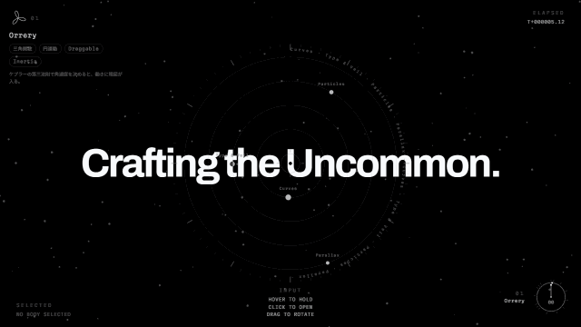<br>
<b>01 Orrery</b><br>
惑星をクリックすると、ラボの分類とその中身が出る。ケプラーの第三法則で角速度を決めている<br>
<sub>三角関数、円運動、慣性つきドラッグ</sub>
</td>
<td width="50%" valign="top">
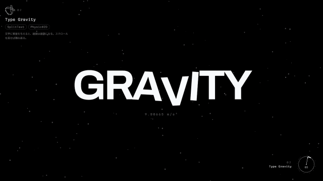<br>
<b>02 Type Gravity</b><br>
文字に質量を与えると、組版は崩落になる。スクロールを戻せば積み直る<br>
<sub>文字分割、2D 物理</sub>
</td>
</tr>
<tr>
<td width="50%" valign="top">
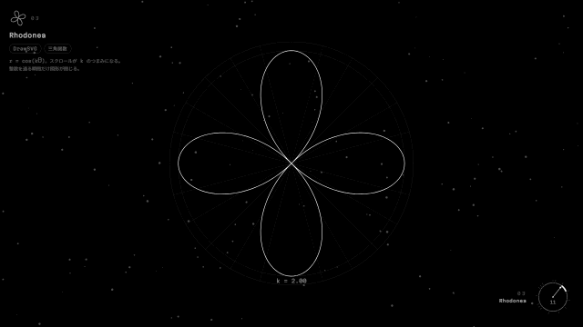<br>
<b>03 Rhodonea</b><br>
r = cos(kθ)。スクロールが k のつまみになり、整数を通る瞬間だけ図形が閉じる<br>
<sub>SVG の線描画、三角関数</sub>
</td>
<td width="50%" valign="top">
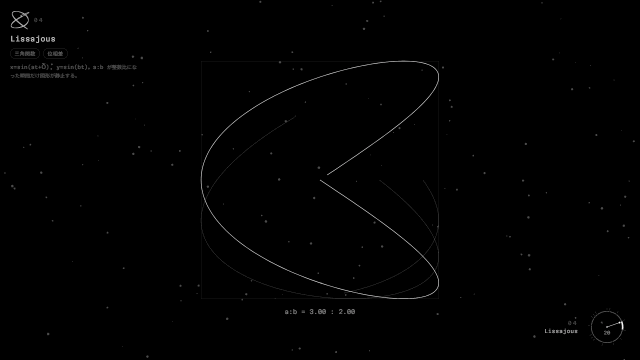<br>
<b>04 Lissajous</b><br>
a:b が整数比になった瞬間だけ図形が静止する<br>
<sub>三角関数、位相差</sub>
</td>
</tr>
<tr>
<td width="50%" valign="top">
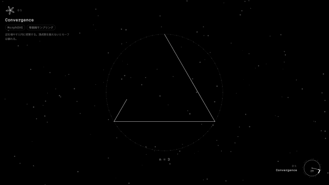<br>
<b>05 Convergence</b><br>
多角形の辺を増やすと円に収束する。頂点数を揃えないと変形が暴れる<br>
<sub>SVG モーフィング、等間隔サンプリング</sub>
</td>
<td width="50%" valign="top">
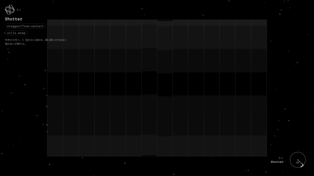<br>
<b>06 Shutter</b><br>
中央から外へ、1 枚おきに逆向きに開く<br>
<sub>時間差アニメーション</sub>
</td>
</tr>
<tr>
<td width="50%" valign="top">
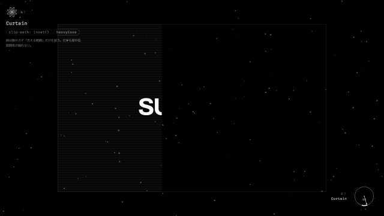<br>
<b>07 Curtain</b><br>
面は動かさず「見える範囲」だけを拭うので、層の位置関係が崩れない<br>
<sub>clip-path</sub>
</td>
<td width="50%" valign="top">
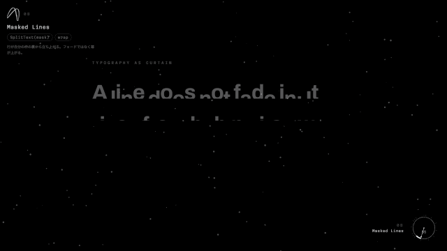<br>
<b>08 Masked Lines</b><br>
行が自分の枠の裏から立ち上がる<br>
<sub>行単位のマスク</sub>
</td>
</tr>
<tr>
<td width="50%" valign="top">
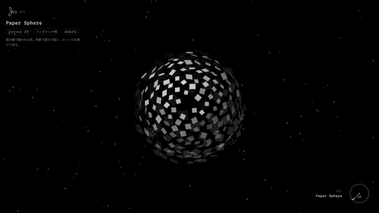<br>
<b>09 Paper Sphere</b><br>
紙の鱗で覆われた球。表裏で濃さが違い、カーソルを避けて戻る<br>
<sub>Canvas 2D、フィボナッチ球、ばね</sub>
</td>
<td width="50%" valign="top">
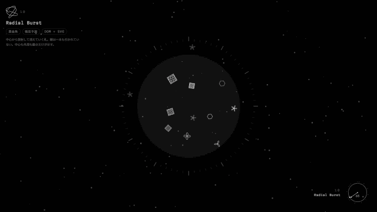<br>
<b>10 Radial Burst</b><br>
中心から放射して消えていく札。線を 1 本も引かずに中心と外周を示す<br>
<sub>黄金角、衝突予測</sub>
</td>
</tr>
<tr>
<td width="50%" valign="top">
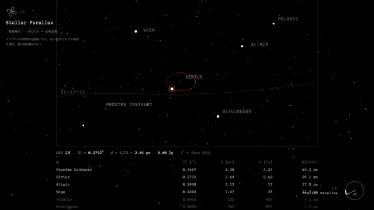<br>
<b>11 Stellar Parallax</b><br>
近い星ほど大きな楕円を描き、遠い星は動かない<br>
<sub>年周視差</sub>
</td>
<td width="50%" valign="top">
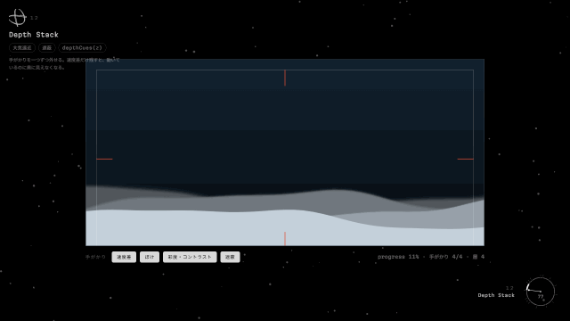<br>
<b>12 Depth Stack</b><br>
奥行きの手がかりを 1 つずつ外して、何が効いているかを比べる<br>
<sub>大気遠近、遮蔽</sub>
</td>
</tr>
<tr>
<td width="50%" valign="top">
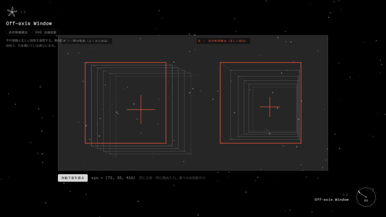<br>
<b>13 Off-axis Window</b><br>
単純な平行移動と正しい透視投影を並べて比べる。カーソルが視点になる<br>
<sub>非対称視錐台、自前の投影計算</sub>
</td>
<td width="50%" valign="top">
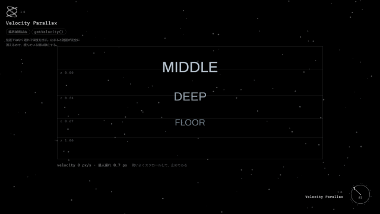<br>
<b>14 Velocity Parallax</b><br>
位置ではなく「遅れ」で奥行きを出す。止まると視差が消える<br>
<sub>臨界減衰ばね、スクロール速度</sub>
</td>
</tr>
<tr>
<td width="50%" valign="top">
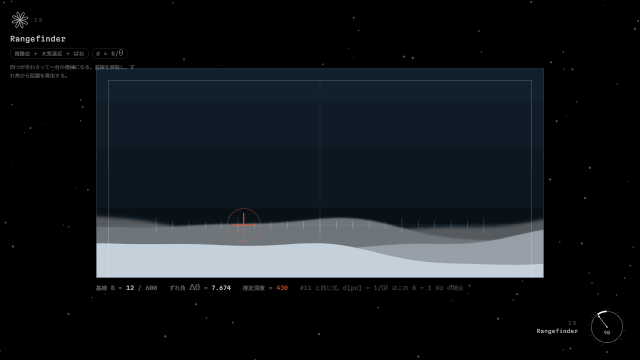<br>
<b>15 Rangefinder</b><br>
11〜14 の仕組みを組み合わせ、ずれ角から距離を算出する測距儀<br>
<sub>視差の三角測量 d = B/θ</sub>
</td>
<td width="50%"></td>
</tr>
</table>

## 取り組み方

見た目の裏側で、次のことを続けてきました。

- **設計してから作る** — 大きな実験は、設計書（何を作るか・なぜか）と実装計画を先に書き、その通りに進めて、終わったら「実装してみて変わったこと」を書き足しています → [`docs/superpowers/`](docs/superpowers/)
- **動きの計算をテストで守る** — 軌道・衝突予測・視差などの計算は画面から切り離して [`lib/`](lib/) に置き、72 件の自動テストで確かめています
- **理由を残す** — コードのコメントには「どう書いたか」より「なぜこの値か」「試して駄目だった案」を書いています
- **レビューで直す** — 実装のあとにコードレビューを通し、見つかった問題を直してからまとめています（コミット履歴に残っています）
- **記事にする準備** — 実測値や踏んだ落とし穴を [`docs/writing/`](docs/writing/) に集めています

開発には AI コーディング支援の Claude Code を使っています。

## 技術構成

- [Next.js](https://nextjs.org/)（App Router、静的書き出し）/ React / TypeScript
- [GSAP](https://gsap.com/)（ScrollTrigger、SplitText、DrawSVG、MorphSVG、Physics2D、Draggable、Inertia）
- Tailwind CSS
- テスト: Node.js 組み込みのテストランナー（`node --test`）
- 公開: GitHub Pages（`main` への push で GitHub Actions がテスト → ビルド → デプロイ）

## 手元で動かす

Node.js 24 以上が必要です。

```bash
npm install
npm run dev      # http://localhost:3000
npm test         # lib/ の計算のテスト
```

公開時と同じ `/armillary/` 配下での表示を確かめるとき:

```bash
PAGES_BASE_PATH=/armillary npm run build
node scripts/serve-pages.mjs   # http://localhost:4000/armillary/
```

README の GIF とヒーロー画像を撮り直すとき（上の配信を立ち上げたまま、別のターミナルで。Google Chrome が必要）:

```bash
npm run readme:capture                    # 全部
npm run readme:capture -- curtain,orrery  # 一部だけ
```

## ディレクトリ構成

```
app/                     ページ本体（1 ページ構成）
components/lab/
  experiments/           実験 1 つにつき 1 ファイル
  registry.ts            実験の並び順。ここに 1 行足すと実験が増える
  LabSection.tsx         実験ごとの見出し・固定表示・切り替えの共通部分
lib/                     動きの計算（軌道、視差、衝突予測など）とそのテスト
docs/superpowers/        設計書と実装計画
docs/writing/            記事用の素材と動くデモ
docs/readme/             この README の画像と GIF
```
